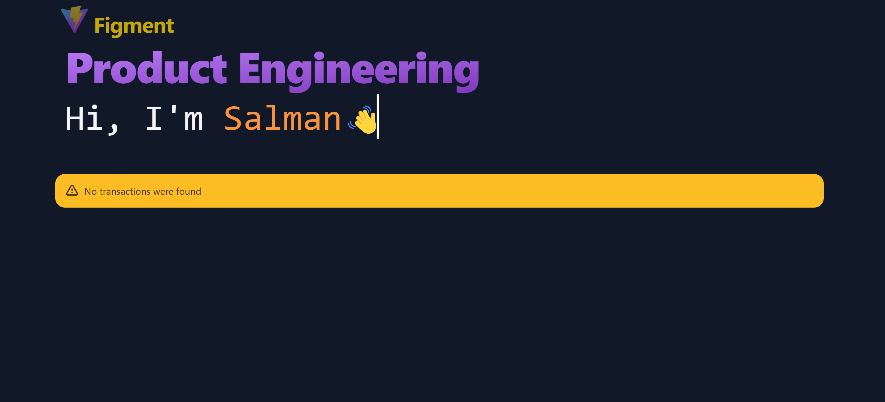
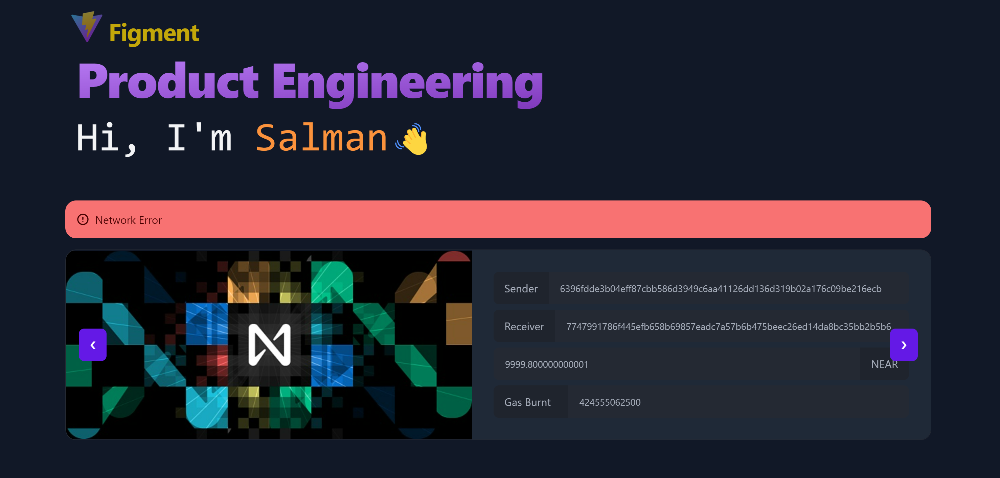
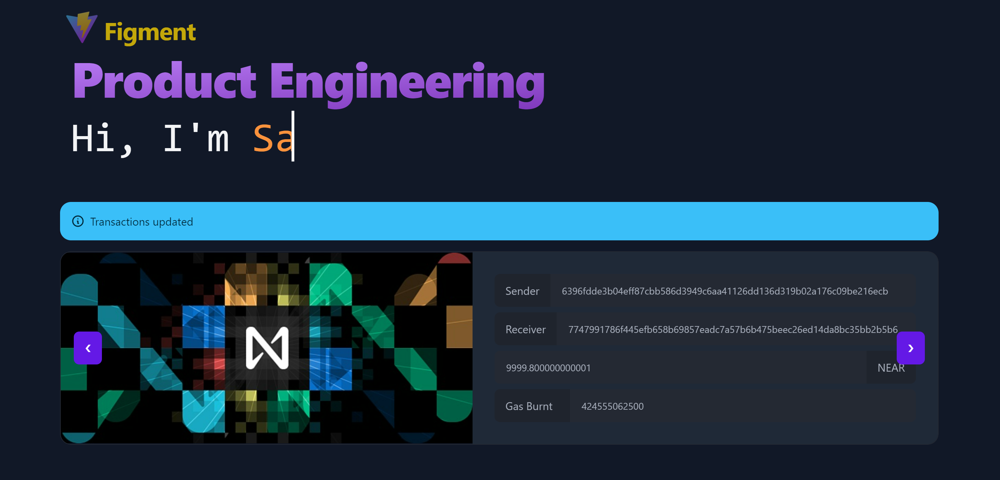
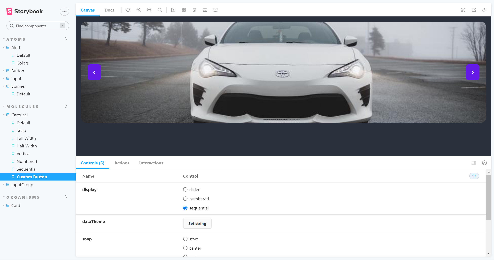

## Features

- ⚡️ [React 18](https://beta.reactjs.org/)
- 🦾 TypeScript
- 🫀 [Jest](https://jestjs.io/) - unitary testing made easy
- 🎨 [Tailwind with JIT](https://tailwindcss.com/) - next generation utility-first CSS
- 🪢 [CSS Modules](https://github.com/css-modules/css-modules)
- 👑 [Atomic Design organization](https://bradfrost.com/blog/post/atomic-web-design/)
- 🗂 [Absolute imports](https://github.com/vitejs/vite/issues/88#issuecomment-762415200)
- 😃 [Hero icons](https://heroicons.com/)
- ⚡️ [Axios](https://axios-http.com/)
- 👑 DaisyUI Components

### Coding Style

- [ESLint](https://eslint.org/) - configured for React/Hooks & TypeScript
- [Prettier](https://prettier.io/)

### Dev tools

- [TypeScript](https://www.typescriptlang.org/)
- [Commit lint](https://github.com/conventional-changelog/commitlint) - helps your team adhering to a commit convention

### Demo

### Steps

1. Install dependencies using
   `yarn install`
2. Start the development with
   `yarn start`
3. You can browse the application using browser
   `http://localhost:3000`
4. For testings
   `yarn test`
5. If you have `API_KEY` add it as `VITE_APP_TRANSATION_API_KEY` to your `.env` file.

### App features

1. Transactions are rendered in the slider displaying `Sender, Receiver, Deposit, and Gas burnt` with an image rof transaction type.
2. You can load different transactions type by passing transaction type to `TransactionView`
3. You can create your own sort and condition to customize the filter the transaction. Currently it filters transactions having ActionType as Transfer and are successul. Sorting is oldest to newest time.
4. Notification system is implemented as context so it can be utilized through out the app. Each alert will be display for default for 5 seconds
   - No transactions available as `Warning` alert
     
   - When api call has failed with Alert type as `Error`
     
   - When transactions is removed or added with Alert type as `Info`.
     
5. It has api polling every 20 seconds.

### Design System

1. You can render the story book with `yarn storybook`
2. Browse all the components at `http://localhost:6006`
3. Compoenents are based on `Daisy UI`, moved here to demostrate design system's structure.

